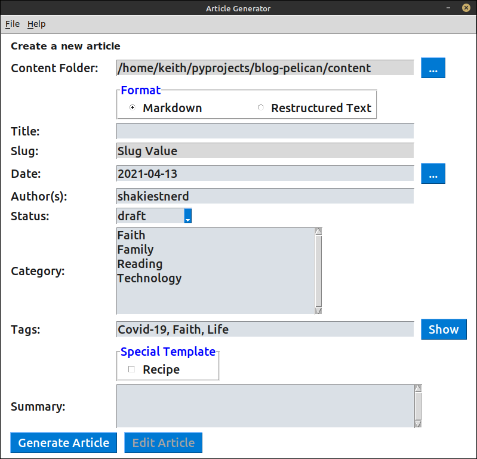

# Pelican Article Generator

This application creates article stubs for writing blog posts using Pelican.

[Pelican](https://blog.getpelican.com/) is a static website generator.

This application has reached the point where I am using it to generate article stubs for my blog.

Documentation for Article Generator can be found at [Read the Docs](https://pelican-article-generator.readthedocs.io/en/latest/).

## What it does

You run `article.py`, fill in a few fields on the form, click the "Create" button. This creates an empty article file you can use to write your blog post.



This allows you to write out several article stubs and once, saving you time and helping you to plan your content more effectively.

## Assumptions and Conventions

### Categories

1. You are using the Pelican static site generator.
2. Article categories are folder names inside the content folder.
3. The folders **'images', 'pages', and 'static'**, if found in your content folder, are ignored and not considered categories.

### Files

Article files are named with the following format:

> YYYY-MM-DD-document-title-separated-by-dashes
>
> **Example:** 2009-10-14-sugary-pecans-or-walnuts.md

Files are saved with these extensions:

- md: Markdown file
- rst: Restructured text file

### Article

Once an article is created, simply open the article in your favorite text editor and replace the "Insert article here" with your own amazing prose.

Sample Markdown Article:

```md
---

Title: Sample Article
Date: 2020-02-21
Category: Technology
Tags: python
Author: shakiestnerd
Status: draft
Summary:
---Insert article here.
```

### Notes

To start the development virtual environment, use:

```bash
source venv\bin\activate
```

Note to self:

Look into using Versioneer to maintain the current version

## Documentation

Stored in docs folder.  

[See Carol Willing talk from Pycon 2018](https://www.youtube.com/watch?v=0ROZRNZkPS8)

Commands:

```bash
make clean
make build

python3 -m http.server
```

Open [http://localhost:8000/docs/build/html/index.html](http://localhost:8000/docs/build/html/index.html)

To use markdown, use recommonmark

```python
import recommonmark.Parser

# Add a source file parser for markdown
source_parsers = {
    '.md': 'recommonmark.parser.CommonMarkParser'
}

# Add type of source files
source_suffix = ['.rst', '.md']
```

Also using the "sphinx_rtd_theme" theme.  See [Read the Docs](https://sphinx-rtd-theme.readthedocs.io/en/latest/installing.html)
for information.

Thank you

