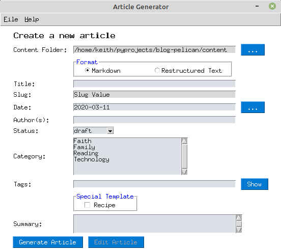
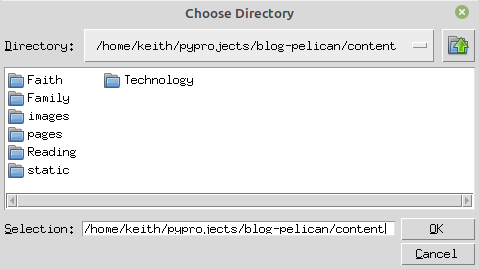
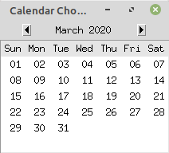

=================
Creating Articles
=================

Launch the Article Generator application with the command:

.. code::

    python article.py

Content Folder
==============

Begin by entering the location or the Pelican *content* folder.  The button
with three dots "**...**" located to the right of the content folder entry
box displays a dialog for selecting the *content* folder.

When the content folder is selected, the application scans for sub-folders.  Any
sub-folders that are found are used to populate the *Categories* list on the form.

    Note: 
    The following sub-folders are ignore because they are used to store non-blog post
    files.

    * images
    * pages
    * static

Format
======

Select the type of file to be generated from the format radio buttons.

Category
========

Be sure to select the **Category** from the list of categories.

When the article is generated, the file that is created will be stored as:

    content folder + category + slug + format

Title, Slug and Date
====================

Next file in the Title field with the title for your article.  As you enter the title,
the slug field will be filled in.  

The Slug field contains the article date plus the title.  The title will be converted to lower case 
and stripped of all punctuation. Spaces are replaced with dashes.

The Date field defaults to the current date, but can be changed to whatever date
you want for the article.  Clicking the three dots "**...**" button to the right of the
date field opens a date selector.

Authors
=======

Enter the name of the author in this field.  Multiple names can be entered into
the field, just separate them with commas.

Status
======

The status field tells Pelican the status for your article.  The default value is
draft.  If you use draft status, be sure to change it in the document to be published
whenever you're ready to see the page on your site.

Status Values:

* draft - won't be published to your site
* published - will be published
* hidden - excludes page from being listed on any menu.

Tags
====

Enter any key words you want to have associated with your article into the Tags field.
Multiple tags can be included; just separate them with commas.

The tags play a key role especially if you have a Tag Cloud configured in your Pelican
set up.

The "**Show**" button is used to pop up the tag handling dialog.

Special Template
================

The **Special Template** area is used when you want to include additional pieces
in your article.  Currently, the only choice is *Recipe* which includes extra
information to aid with writing a food recipe as a post.

Summary
=======

The summary section is used to write a post summary for your article.  When you
use the summary, it will appear on your main web page.  When you click the article
on your blog, it will then display the article.

If you do not use the summary, the main web page will include the first few lines
of your article instead of a summary.  Again, clicking the article on your blog will
display the entire article.

Generate Article
================

When you are satisfied with your field selections, click the "**Generate Article**"
button.  Your article file will then be created.

Edit Article
============

The article can be edited with your favorite text editor. It is stored in the folder
using the pieces on information that were entered on the form.

    content folder + category + slug + format
    
    Example: [Pelican path]/content/Technology/2020-12-25-merry-christmas.rst

Once the article has been generated, the Edit Article button will activate.  
Clicking it will open the newly created file in the default editor for your system.

You can, of course, open the file with any editor of your choice by navigating
to the file location.