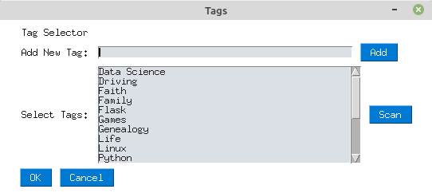

********************
Tags Selector Dialog
********************

The Tags dialog is opened by clicking the **Show** button on the main form.

Add New Tag
===========

Type a tag in the box and click the add button to add a new tag to the **Select Tags** list.

Note: When you run a "Scan", it reloads the **Select Tags** list.

Scan
====

The Scan button will scan all of your existing blog articles for tags that have been used
previously.  It will then populate the **Select Tags** list with a unique list of tags.

Select Tags
===========

Choose one or more tags from the Select Tags list.  Click **OK** to close the dialog and
have your selections copied to the main form.

Choosing **Cancel** will abort your changes and return to the main form.
